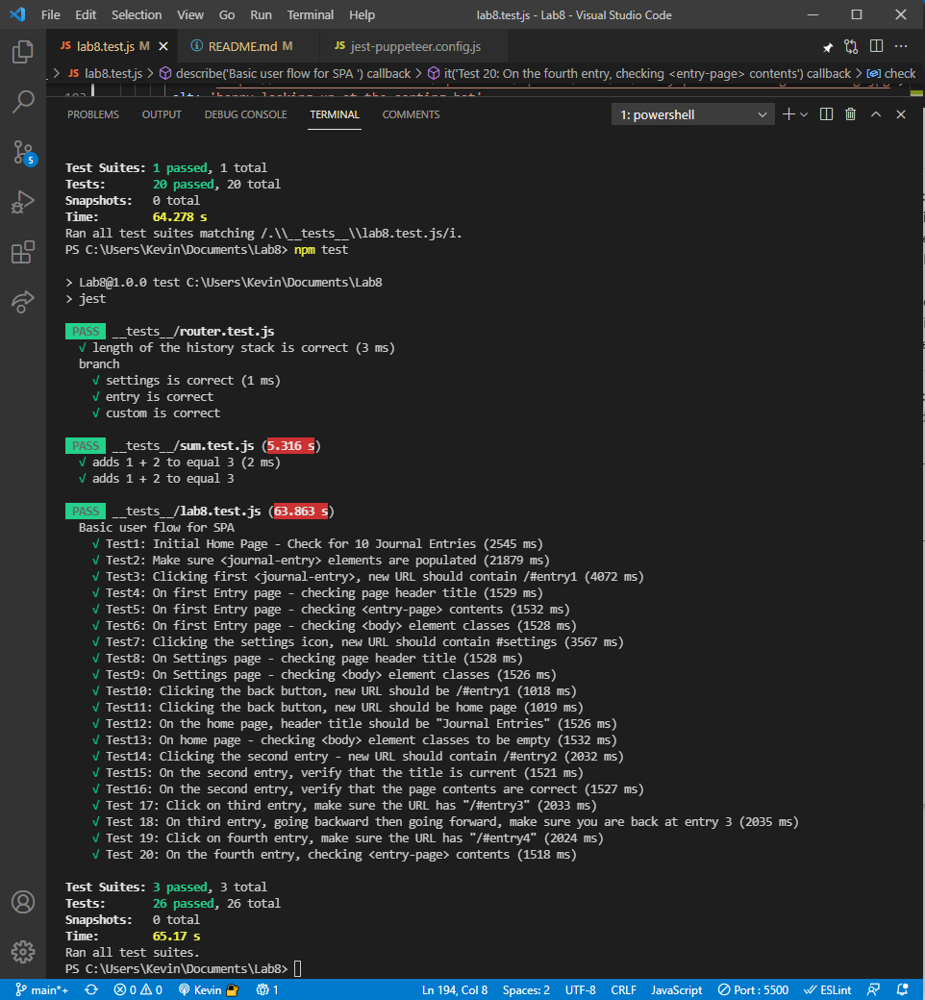

# Lab8_Starter

## Author(s):
  - Simon Liu
  - Kevin Wong

## Check your understanding q's (FILL OUT)
1. In your own words: Where would you fit your automated tests in your Bujo project development pipeline? (just write the letter)
1

2. Would you use a unit test to test the “message” feature of a messaging application? Why or why not? For this question, assume the “message” feature allows a user to write and send a message to another user.
No, because we want to unit test/debug on a small scale and the message feature is a large scale interaction, thus hard to keep trackc of. It is hard to test how users interact with one another.

3. Would you use a unit test to test the “max message length” feature of a messaging application? Why or why not? For this question, assume the “max message length” feature prevents the user from typing more than 80 characters
Yes, because it can be executed quickly by just testing a message with more than 80 characters and a message less than 80 characters.

4. What do you expect to happen if we run our puppeteer tests with the field “headless” set to true?
With "headless" set to true, we can run the tests without a browser UI

5. What would your beforeAll callback look like if you wanted to start from the settings page before every test case?
beforeEach(() => {
   await page.click('img');
})

